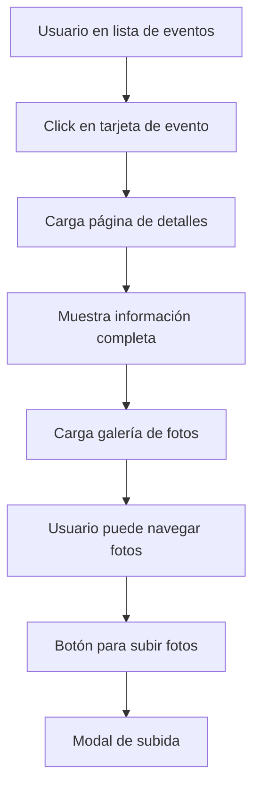
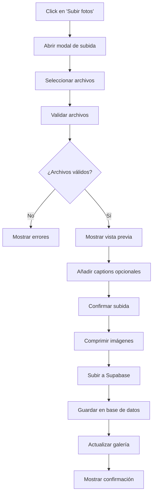
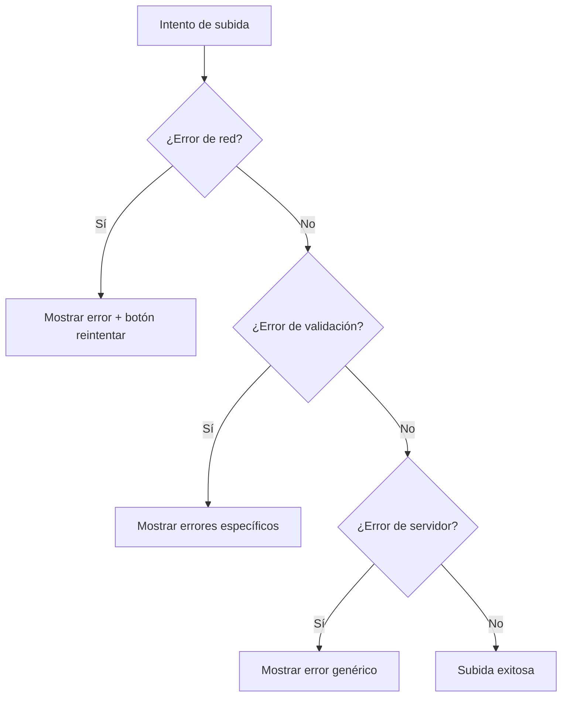

# PRD: Página de Detalles de Eventos con Galería Comunitaria

## 📋 Resumen Ejecutivo

### Objetivo
Desarrollar una página de detalles para cada evento que permita a los usuarios ver información completa del evento y compartir fotos de su experiencia, creando una galería comunitaria en tiempo real.

### Problema a Resolver
Actualmente, los usuarios solo pueden ver información básica de los eventos en tarjetas. No existe un espacio donde puedan:
- Ver información detallada y ampliada de cada evento
- Compartir fotos de su experiencia en el evento
- Ver las fotos compartidas por otros asistentes
- Crear una memoria visual comunitaria de las fiestas

### Solución Propuesta
Crear una página de detalles de evento (ruta `/evento/[id]`) con:
- Información completa del evento
- Galería de fotos subidas por los asistentes
- Sistema de carga de imágenes integrado con Supabase
- Interfaz responsive y optimizada para móviles

---

## 🎯 Objetivos y Métricas

### Objetivos Principales
1. **Engagement**: Aumentar el tiempo de permanencia en la aplicación
2. **Participación**: Fomentar la participación activa de los usuarios
3. **Comunidad**: Crear un sentido de comunidad entre los asistentes
4. **Memoria**: Preservar los recuerdos de las fiestas de Mislata

### Métricas de Éxito
- **Tiempo en página**: Promedio de 2+ minutos en páginas de detalles
- **Fotos subidas**: 10+ fotos por evento popular
- **Usuarios activos**: 15% de usuarios suben al menos una foto
- **Retorno**: 30% de usuarios vuelven a ver fotos después del evento

---

## 👥 Usuarios Objetivo

### Usuario Primario: Asistente Activo
- **Perfil**: Residentes de Mislata de 25-45 años
- **Comportamiento**: Asisten regularmente a eventos, usan smartphone
- **Motivación**: Quieren compartir experiencias y ver las de otros
- **Dolor**: No tienen donde compartir fotos del evento fácilmente

### Usuario Secundario: Curioso/Turista
- **Perfil**: Visitantes o personas interesadas en las fiestas
- **Comportamiento**: Consultan información antes/durante eventos
- **Motivación**: Quieren conocer más detalles y ambiente de eventos
- **Dolor**: Información limitada para decidir asistencia

---

## 🔧 Funcionalidades Detalladas

### 1. Página de Detalles del Evento

#### 1.1 Información del Evento
```typescript
interface EventDetailView {
  // Información básica (ya existente)
  id: string;
  name: string;
  date: string;
  time: string;
  location: string;
  organizer: string;
  category: 'patronales' | 'populares';
  type: string;
  status: 'upcoming' | 'ongoing' | 'finished';
  description?: string;
  order?: string;
  
  // Nueva información extendida
  extendedDescription?: string;
  venue?: string; // Detalles del lugar
  capacity?: number;
  ticketInfo?: string;
  accessibility?: string;
  contact?: string;
  socialLinks?: {
    facebook?: string;
    instagram?: string;
    website?: string;
  };
}
```

#### 1.2 Estructura de la Página
- **Header**: Título del evento, fecha/hora prominente, botones de acción
- **Info Principal**: Descripción, ubicación con mapa, organizador
- **Info Adicional**: Detalles de accesibilidad, contacto, enlaces
- **Galería**: Fotos de la comunidad
- **Acciones**: Subir foto, favorito, compartir

### 2. Sistema de Galería de Fotos

#### 2.1 Estructura de Datos (Supabase)
```sql
-- Tabla de fotos de eventos
CREATE TABLE event_photos (
  id UUID PRIMARY KEY DEFAULT gen_random_uuid(),
  event_id VARCHAR NOT NULL REFERENCES festival_events(id),
  image_url TEXT NOT NULL,
  image_thumbnail_url TEXT,
  uploaded_by VARCHAR, -- Usuario anónimo o ID de usuario
  uploaded_at TIMESTAMP DEFAULT NOW(),
  caption TEXT,
  is_approved BOOLEAN DEFAULT TRUE,
  is_reported BOOLEAN DEFAULT FALSE,
  created_at TIMESTAMP DEFAULT NOW(),
  updated_at TIMESTAMP DEFAULT NOW()
);

-- Índices para optimización
CREATE INDEX idx_event_photos_event_id ON event_photos(event_id);
CREATE INDEX idx_event_photos_uploaded_at ON event_photos(uploaded_at DESC);
```

#### 2.2 Almacenamiento en Supabase Storage
```typescript
// Estructura de buckets en Supabase Storage
const STORAGE_CONFIG = {
  bucket: 'event-photos',
  folders: {
    original: 'original/', // Fotos originales
    thumbnails: 'thumbnails/', // Miniaturas 300x300
    medium: 'medium/' // Fotos medianas 800x600
  },
  policies: {
    maxFileSize: 5 * 1024 * 1024, // 5MB
    allowedTypes: ['image/jpeg', 'image/png', 'image/webp'],
    compressionQuality: 0.8
  }
};
```

### 3. Funcionalidad de Subida de Fotos

#### 3.1 Interfaz de Usuario
- **Botón de carga**: Prominente en la página del evento
- **Drag & Drop**: Zona de arrastre para escritorio
- **Múltiples archivos**: Subida de hasta 5 fotos simultáneas
- **Vista previa**: Mostrar imágenes antes de confirmar subida
- **Caption opcional**: Campo de texto para descripción

#### 3.2 Proceso de Subida
1. **Validación cliente**: Tamaño, formato, cantidad
2. **Compresión**: Optimización automática de imágenes
3. **Subida progresiva**: Barra de progreso
4. **Generación de thumbnails**: Automática en servidor
5. **Confirmación**: Notificación de éxito

#### 3.3 Estados de Carga
```typescript
interface PhotoUploadState {
  isUploading: boolean;
  progress: number; // 0-100
  error?: string;
  uploadedPhotos: UploadedPhoto[];
}

interface UploadedPhoto {
  id: string;
  tempUrl: string; // URL temporal mientras se procesa
  finalUrl?: string; // URL final después de procesamiento
  caption?: string;
  status: 'uploading' | 'processing' | 'completed' | 'error';
}
```

---

## 🎨 Diseño UX/UI

### 1. Navegación y Routing

#### 1.1 Nueva Estructura de Rutas
```typescript
// Rutas actuales
"/" -> Home (lista de eventos)
"/about" -> Acerca de

// Nuevas rutas
"/evento/[id]" -> Detalles del evento
"/evento/[id]/galeria" -> Vista de galería completa (opcional)
```

#### 1.2 Navegación desde Tarjetas de Evento
- **Click en tarjeta**: Navegar a página de detalles
- **Botón "Ver más"**: Enlace explícito a detalles
- **Breadcrumb**: Navegación de vuelta desde detalles

### 2. Layout de Página de Detalles

#### 2.1 Móvil (Diseño Principal)
```
[< Volver] [♡ Favorito] [📤 Compartir]
┌─────────────────────────────────────┐
│ TÍTULO DEL EVENTO                   │
│ 📅 Fecha y hora                     │
│ 📍 Ubicación                        │
├─────────────────────────────────────┤
│ Badge: Estado | Categoría | Tipo    │
├─────────────────────────────────────┤
│ Descripción completa del evento...  │
│                                     │
├─────────────────────────────────────┤
│ 📸 GALERÍA COMUNITARIA (12 fotos)   │
│ [+ Subir tus fotos]                 │
│                                     │
│ [🖼️] [🖼️] [🖼️] [🖼️]               │
│ [🖼️] [🖼️] [🖼️] [🖼️]               │
│                                     │
│ [Ver todas las fotos →]             │
├─────────────────────────────────────┤
│ ℹ️ Información adicional             │
│ • Organizador: ...                  │
│ • Contacto: ...                     │
│ • Accesibilidad: ...                │
└─────────────────────────────────────┘
```

#### 2.2 Desktop
- **Layout en 2 columnas**: Info principal + galería lateral
- **Galería expandida**: Más fotos visibles
- **Acciones flotantes**: Botones de acción fijos

### 3. Modal de Subida de Fotos

#### 3.1 Diseño del Modal
```
┌─────────────────────────────────────┐
│ Subir fotos a "NOMBRE DEL EVENTO"   │
│                                     │
│ ┌─────────────────────────────────┐ │
│ │  📤 Arrastra fotos aquí         │ │
│ │     o toca para seleccionar     │ │
│ │                                 │ │
│ │  [Seleccionar archivos]         │ │
│ └─────────────────────────────────┘ │
│                                     │
│ Vista previa:                       │
│ [🖼️ caption] [🖼️ caption] [❌]      │
│                                     │
│ [Cancelar] [Subir 3 fotos] ✨       │
└─────────────────────────────────────┘
```

---

## 🛠️ Especificaciones Técnicas

### 1. Integración con Supabase

#### 1.1 Configuración Inicial
```typescript
// supabase/config.ts
import { createClient } from '@supabase/supabase-js';

const supabaseUrl = process.env.VITE_SUPABASE_URL!;
const supabaseAnonKey = process.env.VITE_SUPABASE_ANON_KEY!;

export const supabase = createClient(supabaseUrl, supabaseAnonKey);

// Configuración de Storage
export const STORAGE_BUCKET = 'event-photos';
export const STORAGE_POLICIES = {
  maxSize: 5 * 1024 * 1024, // 5MB
  allowedTypes: ['image/jpeg', 'image/png', 'image/webp']
};
```

#### 1.2 Políticas de Seguridad (RLS)
```sql
-- Permitir lectura pública de fotos
CREATE POLICY "Public photos are viewable by everyone" 
ON event_photos FOR SELECT 
USING (is_approved = true);

-- Permitir subida de fotos (usuarios anónimos)
CREATE POLICY "Anyone can upload photos" 
ON event_photos FOR INSERT 
WITH CHECK (true);

-- Solo admins pueden moderar
CREATE POLICY "Only admins can moderate" 
ON event_photos FOR UPDATE 
USING (auth.jwt() ->> 'role' = 'admin');
```

### 2. Componentes React

#### 2.1 Componente Principal: EventDetail
```typescript
// src/pages/event-detail.tsx
interface EventDetailProps {
  eventId: string;
}

export default function EventDetail({ eventId }: EventDetailProps) {
  // Hooks para datos del evento y fotos
  const { data: event, isLoading: eventLoading } = useEvent(eventId);
  const { data: photos, isLoading: photosLoading } = useEventPhotos(eventId);
  
  // Estados para UI
  const [showUploadModal, setShowUploadModal] = useState(false);
  const [selectedPhoto, setSelectedPhoto] = useState<string | null>(null);
  
  // ... resto de la implementación
}
```

#### 2.2 Hook para Gestión de Fotos
```typescript
// src/hooks/use-event-photos.ts
export function useEventPhotos(eventId: string) {
  return useQuery({
    queryKey: ['event-photos', eventId],
    queryFn: () => fetchEventPhotos(eventId),
    staleTime: 5 * 60 * 1000, // 5 minutos
  });
}

export function usePhotoUpload(eventId: string) {
  const queryClient = useQueryClient();
  
  return useMutation({
    mutationFn: (files: File[]) => uploadPhotos(eventId, files),
    onSuccess: () => {
      queryClient.invalidateQueries(['event-photos', eventId]);
    },
  });
}
```

#### 2.3 Servicio de Fotos
```typescript
// src/lib/photo-service.ts
export async function uploadPhotos(eventId: string, files: File[]): Promise<UploadResult[]> {
  const results: UploadResult[] = [];
  
  for (const file of files) {
    try {
      // 1. Validar archivo
      validateFile(file);
      
      // 2. Comprimir imagen
      const compressedFile = await compressImage(file);
      
      // 3. Generar nombre único
      const fileName = generateFileName(file.name);
      
      // 4. Subir a Supabase Storage
      const { data, error } = await supabase.storage
        .from(STORAGE_BUCKET)
        .upload(`original/${fileName}`, compressedFile);
      
      if (error) throw error;
      
      // 5. Guardar metadata en base de datos
      const photoRecord = await createPhotoRecord(eventId, data.path);
      
      results.push({ success: true, photo: photoRecord });
    } catch (error) {
      results.push({ success: false, error: error.message });
    }
  }
  
  return results;
}
```

### 3. Optimizaciones de Rendimiento

#### 3.1 Lazy Loading de Imágenes
```typescript
// src/components/photo-gallery.tsx
import { LazyImage } from '@/components/lazy-image';

export function PhotoGallery({ photos }: { photos: EventPhoto[] }) {
  return (
    <div className="grid grid-cols-2 md:grid-cols-4 gap-2">
      {photos.map((photo) => (
        <LazyImage
          key={photo.id}
          src={photo.thumbnail_url}
          alt={photo.caption || 'Foto del evento'}
          className="aspect-square object-cover rounded-lg"
          onClick={() => openLightbox(photo)}
        />
      ))}
    </div>
  );
}
```

#### 3.2 Compresión de Imágenes
```typescript
// src/lib/image-compression.ts
export async function compressImage(file: File): Promise<File> {
  return new Promise((resolve) => {
    const canvas = document.createElement('canvas');
    const ctx = canvas.getContext('2d')!;
    const img = new Image();
    
    img.onload = () => {
      // Calcular nuevas dimensiones manteniendo aspect ratio
      const { width, height } = calculateDimensions(img, 1200); // Max 1200px
      
      canvas.width = width;
      canvas.height = height;
      
      // Dibujar imagen redimensionada
      ctx.drawImage(img, 0, 0, width, height);
      
      // Convertir a blob comprimido
      canvas.toBlob(resolve, 'image/jpeg', 0.8);
    };
    
    img.src = URL.createObjectURL(file);
  });
}
```

---

## 🔄 Flujos de Usuario

### 1. Flujo Principal: Ver Detalles del Evento



### 2. Flujo de Subida de Fotos



### 3. Estados de Error y Recuperación



---

## 📱 Consideraciones Móviles

### 1. Diseño Responsive
- **Mobile-first**: Diseño prioritario para móviles
- **Touch-friendly**: Botones mínimo 44px
- **Swipe gestures**: Navegación de galería por gestos
- **Pull-to-refresh**: Actualizar fotos con gesto

### 2. Optimización de Datos
- **Progressive loading**: Cargar fotos bajo demanda
- **WebP support**: Formato moderno cuando sea posible
- **Offline handling**: Mostrar mensaje cuando no hay conexión
- **Cache inteligente**: Guardar fotos vistas recientemente

### 3. UX Específica Móvil
- **Fullscreen gallery**: Modal de galería a pantalla completa
- **Share API**: Usar API nativa de compartir cuando esté disponible
- **Photo capture**: Botón para tomar foto directamente
- **Haptic feedback**: Vibraciones para confirmaciones

---

## 🔐 Seguridad y Moderación

### 1. Validación de Contenido
```typescript
// Validaciones en cliente y servidor
const VALIDATION_RULES = {
  fileSize: 5 * 1024 * 1024, // 5MB máximo
  allowedTypes: ['image/jpeg', 'image/png', 'image/webp'],
  maxFiles: 5, // Máximo 5 archivos por vez
  dimensions: {
    maxWidth: 4096,
    maxHeight: 4096,
    minWidth: 300,
    minHeight: 300
  }
};
```

### 2. Sistema de Reportes
- **Botón de reporte**: En cada foto para usuarios
- **Moderación automática**: Filtros básicos de contenido
- **Queue de moderación**: Para administradores
- **Acciones**: Ocultar, eliminar, banear usuario

### 3. Rate Limiting
```typescript
// Límites por usuario/IP
const RATE_LIMITS = {
  photosPerHour: 10, // Máximo 10 fotos por hora
  photosPerDay: 30,  // Máximo 30 fotos por día
  sameEventLimit: 5  // Máximo 5 fotos por evento
};
```

---

## 📊 Analytics y Métricas

### 1. Eventos a Trackear
```typescript
// Eventos de analytics para la nueva funcionalidad
const ANALYTICS_EVENTS = {
  // Navegación
  'event_detail_view': { eventId, source }, // Vista de detalles
  'photo_gallery_open': { eventId, photoCount }, // Abrir galería
  
  // Interacciones con fotos
  'photo_upload_start': { eventId, fileCount }, // Iniciar subida
  'photo_upload_success': { eventId, photosUploaded }, // Subida exitosa
  'photo_upload_error': { eventId, errorType }, // Error en subida
  'photo_view': { eventId, photoId }, // Ver foto individual
  'photo_share': { eventId, photoId, platform }, // Compartir foto
  
  // Comportamiento
  'gallery_scroll': { eventId, photosViewed }, // Scroll en galería
  'back_to_events': { eventId, timeSpent }, // Volver a lista
};
```

### 2. Métricas de Negocio
- **Engagement rate**: % de usuarios que suben fotos
- **Photos per event**: Promedio de fotos por evento
- **Time on page**: Tiempo promedio en detalles
- **Return rate**: % de usuarios que vuelven a ver fotos

---

## 🚀 Roadmap de Implementación

### Fase 1: Core Functionality (2-3 semanas)
1. **Semana 1-2**: 
   - ✅ Configurar Supabase Storage y base de datos
   - ✅ Crear página de detalles básica
   - ✅ Implementar routing dinámico
   - ✅ Diseñar estructura de datos

2. **Semana 2-3**:
   - ✅ Sistema de subida de fotos
   - ✅ Galería básica de visualización
   - ✅ Compresión de imágenes
   - ✅ Validaciones de seguridad

### Fase 2: UX Enhancements (1-2 semanas)
3. **Semana 3-4**:
   - ✅ Modal de galería completa
   - ✅ Lightbox para fotos individuales
   - ✅ Optimizaciones móviles
   - ✅ Loading states y error handling

### Fase 3: Polish & Analytics (1 semana)
4. **Semana 4-5**:
   - ✅ Analytics events
   - ✅ SEO optimization
   - ✅ Performance tuning
   - ✅ Testing y bug fixes

### Fase 4: Advanced Features (Futuro)
5. **Backlog**:
   - Sistema de moderación de contenido
   - Filtros y búsqueda en galería
   - Comentarios en fotos
   - Sistema de likes/reacciones
   - Integración con redes sociales

---

## 🔧 Dependencias y Configuración

### 1. Nuevas Dependencias NPM
```json
{
  "dependencies": {
    "@supabase/supabase-js": "^2.38.0",
    "react-image-compress": "^1.5.0", 
    "react-dropzone": "^14.2.3",
    "react-image-gallery": "^1.3.0",
    "browser-image-compression": "^2.0.2"
  }
}
```

### 2. Variables de Entorno
```env
# Supabase Configuration
VITE_SUPABASE_URL=https://your-project.supabase.co
VITE_SUPABASE_ANON_KEY=your-anon-key
VITE_SUPABASE_STORAGE_BUCKET=event-photos

# Feature Flags
VITE_ENABLE_PHOTO_UPLOAD=true
VITE_MAX_PHOTO_SIZE=5242880
VITE_MAX_PHOTOS_PER_UPLOAD=5
```

### 3. Configuración de Supabase
```sql
-- Script de setup de base de datos
-- Crear tabla de fotos
CREATE TABLE event_photos (
  id UUID PRIMARY KEY DEFAULT gen_random_uuid(),
  event_id VARCHAR NOT NULL,
  image_url TEXT NOT NULL,
  image_thumbnail_url TEXT,
  uploaded_by VARCHAR,
  uploaded_at TIMESTAMP DEFAULT NOW(),
  caption TEXT,
  is_approved BOOLEAN DEFAULT TRUE,
  is_reported BOOLEAN DEFAULT FALSE,
  metadata JSONB,
  created_at TIMESTAMP DEFAULT NOW(),
  updated_at TIMESTAMP DEFAULT NOW()
);

-- Crear bucket de storage
INSERT INTO storage.buckets (id, name, public) 
VALUES ('event-photos', 'event-photos', true);
```

---

## ✅ Criterios de Aceptación

### 1. Funcionalidad Core
- [ ] **Routing**: Cada evento tiene una URL única `/evento/[id]`
- [ ] **Navegación**: Se puede acceder desde tarjetas de evento
- [ ] **Información**: Muestra todos los datos del evento correctamente
- [ ] **Galería**: Muestra fotos subidas por usuarios
- [ ] **Subida**: Los usuarios pueden subir fotos exitosamente
- [ ] **Responsive**: Funciona correctamente en móvil y desktop

### 2. UX/UI
- [ ] **Performance**: Página carga en menos de 2 segundos
- [ ] **Progreso**: Muestra estado de carga durante subidas
- [ ] **Errores**: Maneja errores de forma amigable
- [ ] **Accesibilidad**: Compatible con lectores de pantalla
- [ ] **SEO**: Meta tags apropiados para compartir

### 3. Seguridad
- [ ] **Validación**: Solo acepta archivos de imagen válidos
- [ ] **Tamaño**: Respeta límites de tamaño de archivo
- [ ] **Rate limiting**: Previene spam de subidas
- [ ] **Sanitización**: URLs de imágenes son seguras

### 4. Analytics
- [ ] **Tracking**: Eventos importantes son trackeados
- [ ] **Métricas**: Dashboard muestra métricas relevantes
- [ ] **Reportes**: Datos útiles para decisiones de producto

---

## 🎉 Beneficios Esperados

### Para los Usuarios
- **Más información**: Detalles completos de eventos antes de asistir
- **Memoria visual**: Preservar y compartir recuerdos de las fiestas
- **Comunidad**: Conectar con otros asistentes a través de fotos
- **Descubrimiento**: Ver el ambiente real de eventos pasados

### Para el Producto
- **Engagement**: Mayor tiempo de uso y retención
- **Contenido**: Galería de fotos generada por usuarios
- **Viral**: Funcionalidad compartible que atrae nuevos usuarios
- **Datos**: Métricas sobre preferencias y comportamiento

### Para Mislata/Organizadores
- **Promoción**: Fotos reales promocionan futuros eventos
- **Feedback**: Ver participación y satisfacción real
- **Archivo**: Registro visual de las fiestas por años
- **Alcance**: Mayor visibilidad en redes sociales

---

## 🔮 Visión Futura

Esta funcionalidad establece las bases para características avanzadas como:
- **Live streaming** de eventos en tiempo real
- **Realidad aumentada** para información contextual en ubicaciones
- **Social features** como seguir fotógrafos favoritos
- **Colaboración** con medios locales para cobertura oficial
- **E-commerce** para venta de merchandising de eventos
- **Gamificación** con badges por participación en eventos

---

*Documento PRD v1.0 - Creado en Enero 2025*
*Última actualización: Enero 2025*
